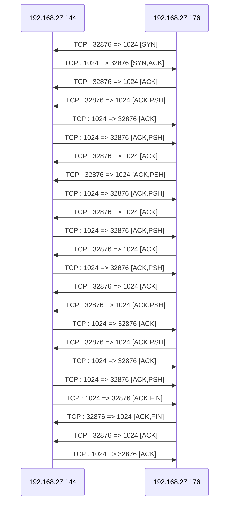

# Server Secure Communication Script

## Description

This script implements a server that establishes secure communication with multiple clients using TLS and Diffie-Hellman key exchange. It also includes functionality to generate a certificate from a CA certificate. You can provide your own certificate and key. The script offers both a graphical user interface (GUI) and a command-line interface (CLI).

## Features

- Secure client connections via TLS.
- Diffie-Hellman key exchange for message encryption.
- Receiving and sending encrypted messages.
- Server certificate and key generation from a CA.

## Dependencies

The script requires the following libraries:
- socket
- sys
- threading
- psutil
- time
- tkinter
- ssl
- random
- json
- OpenSSL
- hashlib
- os
- Crypto

A requirements.txt file is provided for dependencies, except for tkinter, which must be installed manually:

- For Debian / Ubuntu:
    sudo apt install python-tk

- For Arch Linux / Manjaro:
    sudo pacman -S tk

- For Fedora / Red Hat / CentOS:
    sudo dnf install python3-tkinter

- For Alpine Linux:
    sudo apk add python3-tkinter

- For macOS:
    brew install python-tk

- For Windows:
    Install via Python packages

## Usage

### Using the GUI

Launch the application with the graphical interface:

    python app_graphique_server.py

The interface allows you to:

1. Initialize the server(s)
2. Create certificates

GUI example:
    

### CLI Menu

Launch the application in CLI mode:

    python app_cli_server.py

The menu offers the following option:

1. Initialize the server

CLI example:
    

## Error Handling

In case of an error, the script displays an error message and indicates where the error occurred. The server remains online if the error was caused by a client.

## Example of a connection between the server and a client




## Author

Script developed by Sriconnan


# Client Secure Communication Script

## Description

Ce script implémente un client permettant d'établir une communication sécurisée avec un serveur via TLS et un échange de clés Diffie-Hellman. Il inclut également des fonctionnalités de résolution DNS, de scan de ports et propose une interface graphique (GUI) ainsi qu'un menu interactif en ligne de commande (CLI).

## Fonctionnalités

- Connexion sécurisée au serveur avec TLS.
- Échange de clés Diffie-Hellman pour le chiffrement des messages.
- Envoi et réception de messages chiffrés.
- Résolution DNS directe et inversée.
- Récupération des enregistrements DNS (A, AAAA, MX, NS, CNAME, TXT).
- Scan de ports TCP.
- **Interface graphique (GUI)** permettant une interaction intuitive avec le client.
- **Menu interactif CLI** permettant d'exécuter facilement les différentes fonctionnalités.

## Dépendances

Le script nécessite les bibliothèques suivantes :

- `socket`
- `ssl`
- `dns.resolver`
- `random`
- `json`
- `scapy`
- `tkinter` (pour l'interface graphique)
- `diffie_helman_client` (module externe pour la gestion de Diffie-Hellman)

## Installation

Avant d'exécuter le script, assurez-vous d'installer les dépendances nécessaires avec la commande :

```sh
pip install dnspython scapy
```

## Utilisation

### Interface Graphique (GUI)

Lancer l'application avec l'interface graphique :

```sh
python client_gui.py
```

L'interface permet de :

- Créer une connexion client en spécifiant l'IP du serveur et le port.
- Envoyer des requêtes Echo.
- Effectuer des requêtes DNS.
- Scanner des ports.

#### Exemples de l'interface graphique

_Insérez ici des captures d'écran de l'interface graphique._

### Lancement du menu CLI

```sh
python client_cli.py
```

L'utilisateur est invité à entrer l'adresse IP ou le nom de domaine du serveur cible avant d'afficher un menu interactif permettant d'effectuer diverses opérations.

### Menu CLI

Le menu propose les options suivantes :

1. **Requête Echo** : Envoie un message au serveur et affiche la réponse.
2. **DNS** : Accès à un sous-menu pour effectuer des résolutions DNS directes, inversées et récupérer des enregistrements DNS.
3. **Scan de port** : Permet de scanner un ou plusieurs ports sur l'hôte cible.
4. **Quitter** : Ferme l'application.

### Exécution des fonctionnalités en dehors du menu

#### Initialisation du client

```python
client = Client("192.168.1.1")
```

#### Exécution du client et envoi d'un message

```python
client.Run_client(443, "Hello, Server!")
```

#### Résolution DNS

```python
print(client.resolution_dns("example.com"))
```

#### Résolution DNS inversée

```python
print(client.reverse_resolution_dns())
```

#### Récupération des enregistrements DNS

```python
client.get_dns_records("example.com")
```

#### Scan de ports

```python
client.run_scan([80, 443, 22])
```

## Gestion des erreurs

En cas d'erreur réseau, le script affiche un message d'erreur et ferme correctement la connexion.

## Auteur

Script développé par lenzzair.
