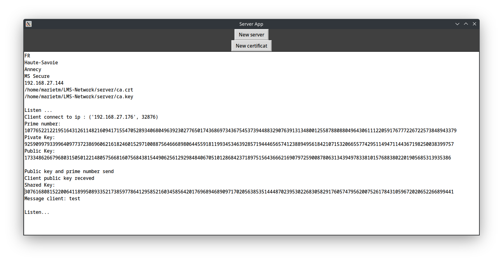
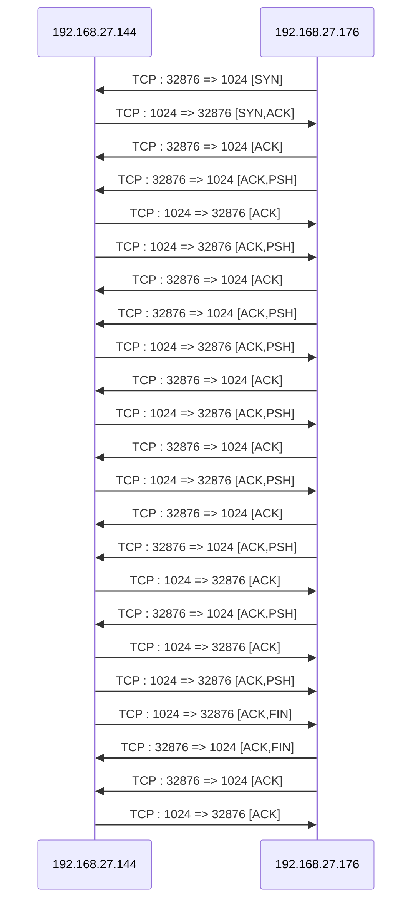

# Server Secure Communication Script

## Description

This script implements a server that establishes secure communication with multiple clients using TLS and Diffie-Hellman key exchange. It also includes functionality to generate a certificate from a CA certificate. You can provide your own certificate and key. The script offers both a graphical user interface (GUI) and a command-line interface (CLI).

## Features

- Secure client connections via TLS.
- Diffie-Hellman key exchange for message encryption.
- Receiving and sending encrypted messages.
- Server certificate and key generation from a CA.

## Dependencies

The script requires the following libraries:
- socket
- sys
- threading
- psutil
- time
- tkinter
- ssl
- random
- json
- OpenSSL
- hashlib
- os
- Crypto

A requirements.txt file is provided for dependencies, except for tkinter, which must be installed manually:

- For Debian / Ubuntu:
    sudo apt install python-tk

- For Arch Linux / Manjaro:
    sudo pacman -S tk

- For Fedora / Red Hat / CentOS:
    sudo dnf install python3-tkinter

- For Alpine Linux:
    sudo apk add python3-tkinter

- For macOS:
    brew install python-tk

- For Windows:
    Install via Python packages

## Usage

### Using the GUI

Launch the application with the graphical interface:

    python app_graphique_server.py

The interface allows you to:

1. Initialize the server(s)
2. Create certificates

GUI example:
    

### CLI Menu

Launch the application in CLI mode:

    python app_cli_server.py

The menu offers the following option:

1. Initialize the server

CLI example:
    

## Error Handling

In case of an error, the script displays an error message and indicates where the error occurred. The server remains online if the error was caused by a client.

## Example of a connection between the server and a client

## Author

Script developed by Sriconnan