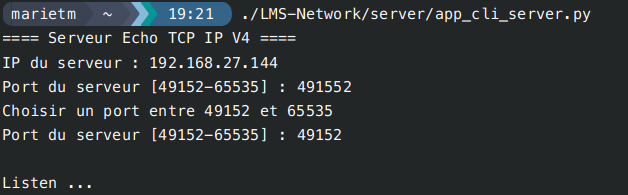

# Server Secure Communication Script

## Description

This script implements a server that establishes secure communication with multiple clients using TLS and Diffie-Hellman key exchange. It also includes functionality to generate a certificate from a CA certificate. You can provide your own certificate and key. The script offers both a graphical user interface (GUI) and a command-line interface (CLI).

## Features

- Secure client connections via TLS.
- Diffie-Hellman key exchange for message encryption.
- Receiving and sending encrypted messages.
- Server certificate and key generation from a CA.

## Dependencies

The script requires the following libraries:
- socket
- sys
- threading
- psutil
- time
- tkinter
- ssl
- random
- json
- OpenSSL
- hashlib
- os
- Crypto

A requirements.txt file is provided for dependencies, except for tkinter, which must be installed manually:

- For Debian / Ubuntu:
    sudo apt install python-tk

- For Arch Linux / Manjaro:
    sudo pacman -S tk

- For Fedora / Red Hat / CentOS:
    sudo dnf install python3-tkinter

- For Alpine Linux:
    sudo apk add python3-tkinter

- For macOS:
    brew install python-tk

- For Windows:
    Install via Python packages

## Usage

### Using the GUI

Launch the application with the graphical interface:

    python app_graphique_server.py

The interface allows you to:

1. Initialize the server(s)
2. Create certificates

GUI example:
    

### CLI Menu

Launch the application in CLI mode:

    python app_cli_server.py

The menu offers the following option:

1. Initialize the server

CLI example:
    

## Error Handling

In case of an error, the script displays an error message and indicates where the error occurred. The server remains online if the error was caused by a client.

## Example of a connection between the server and a client


## Author

Script developed by Sriconnan


# Secure Communication Client Script

## Description

This script implements a client that establishes secure communication with a server using TLS and Diffie-Hellman key exchange. It also includes DNS resolution, TCP port scanning, a graphical user interface (GUI), and an interactive command-line interface (CLI) menu.

## Features

- Secure server connection via TLS.
- Diffie-Hellman key exchange for encrypted messaging.
- Encrypted message sending and receiving.
- Direct and reverse DNS resolution.
- Retrieval of DNS records (A, AAAA, MX, NS, CNAME, TXT).
- TCP port scanning.
- **Graphical User Interface (GUI)** for intuitive interaction.
- **Interactive CLI menu** for easy access to all features.

## Dependencies

The script requires the following libraries:

- `socket`
- `ssl`
- `dns.resolver`
- `random`
- `json`
- `scapy`
- `tkinter` (for GUI)
- `diffie_helman_client` (external module for Diffie-Hellman management)

## Installation

Before running the script, install the required dependencies with:

```sh
pip install dnspython scapy
```

## Usage

### Graphical User Interface (GUI)

To start the GUI application:

```sh
python client_gui.py
```

The GUI allows you to:

- Create a client connection by specifying the server IP and port.
- Send Echo requests.
- Perform DNS queries.
- Scan ports.

#### GUI Screenshots

_Insert GUI screenshots here._

### Launching the CLI Menu

```sh
python client_cli.py
```

You’ll be prompted to enter the server’s IP address or domain name. Then, an interactive menu will appear, offering various operations.

### CLI Menu Options

1. **Echo Request** – Sends a message to the server and displays the response.
2. **DNS** – Opens a sub-menu for direct, reverse DNS resolution, and retrieving DNS records.
3. **Port Scan** – Scans one or more ports on the target host.
4. **Quit** – Exits the application.

### Running Features Outside the Menu

#### Client Initialization

```python
client = Client("192.168.1.1")
```

#### Running the Client and Sending a Message

```python
client.Run_client(443, "Hello, Server!")
```

#### DNS Resolution

```python
print(client.resolution_dns("example.com"))
```

#### Reverse DNS Resolution

```python
print(client.reverse_resolution_dns())
```

#### Retrieving DNS Records

```python
client.get_dns_records("example.com")
```

#### Port Scanning

```python
client.run_scan([80, 443, 22])
```

## Error Handling

In case of network errors, the script displays an error message and gracefully closes the connection.

## Author

Script developed by lenzzair.
